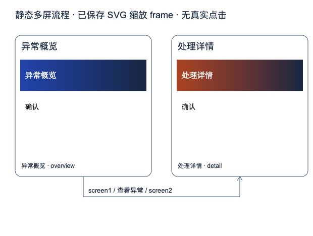

# Pi Design Mode

Brief-first SVG design exploration for the pre-build and prototype stage in [Pi](https://pi.dev).

Use conversation plus safe, self-contained SVG to compare directions, refine named regions, review design decisions, and discuss multi-screen flows before building an HTML prototype or product UI.

[Watch the 74-second product demo](https://raw.githubusercontent.com/liush2yuxjtu/pi-design-mode/main/assets/pi-design-mode-product-demo.mp4)



## Why

Full interactive prototypes are often too expensive early. Pi Design Mode keeps the first loop small:

```text
brief → 2–4 SVG directions → select → protect regions → revise → compare → review → static flow → handoff
```

SVG remains source of truth. PNG is preview. No browser runtime, scripts, external images, or fake clickable prototype.

## Features

- Structured six-field brief: user, scenario, goal, required elements, exclusions, visual direction
- Two to four visual directions in one revision
- Stable region IDs for focused feedback
- User-confirmed approved/locked regions
- Byte-preserving edits outside changed regions
- Before/after revision comparison
- Minimal design specification: colors, typography, spacing, radii, component rules
- Evidence-linked review across Intent, Hierarchy, Clarity, Consistency, and Feasibility
- Static two-to-four-screen SVG flows using actual saved screens
- Session-aware history, branching, recovery, immutable artifacts, and SHA-256 checks
- Restricted SVG grammar and offline XML validation

## Requirements

- macOS
- Pi
- Node.js 20.3 or newer
- macOS system tools `/usr/bin/xmllint` and `/usr/bin/sips`

The macOS requirement exists because V0 deliberately uses one native SVG-to-PNG renderer: `sips`.

## Install

From npm:

```bash
pi install npm:pi-design-mode
```

Try without persistent installation:

```bash
pi -e npm:pi-design-mode
```

After upgrading an already-running Pi session, run `/reload`.

## Use

Start with plain text and let Pi complete missing brief fields:

```text
/design Design a compact incident dashboard for an operations stand-up
```

Or start with a complete brief:

```text
/design {"user":"值班运营","scenario":"晨会前处理异常订单","goal":"先发现异常，再进入处理详情","must":["异常数量","一个主操作"],"mustNot":["外部资源","真实点击"],"direction":"清晰、紧凑，重点突出"}
```

Stop while preserving all work:

```text
/design-stop
```

Pi calls two tools while mode is active:

- `design_render`: complete SVG, direction batch, region update, or static flow
- `design_manage`: brief, selection, protection, specification, review, history, and comparison

Detailed schemas, limits, state behavior, recovery guidance, and runnable examples: [`extensions/design-mode/USAGE.md`](extensions/design-mode/USAGE.md).

## Scope

Good fit:

- product direction discussion
- information architecture
- page structure
- visual direction exploration
- color, typography, and spacing trials
- pre-build design review
- static screen-flow discussion

Not provided:

- real interactions or click handling
- HTML/CSS/JS prototype runtime
- usability testing
- pixel-level visual scoring
- general-purpose SVG editing
- Windows or Linux rendering in V0

## Security

Pi extensions execute with user permissions. Review source before installation.

This extension accepts only a restricted SVG subset. It rejects scripts, `foreignObject`, images, `use`, links, event handlers, CSS, declarations, entities, processing instructions, external resources, and unsafe namespaces. `xmllint` runs with `--nonet` before `sips` rendering.

Region protection is an extension workflow constraint, not an OS sandbox. See [SECURITY.md](SECURITY.md) for reporting and trust boundaries.

No telemetry is collected by this package.

## Development

```bash
npm install
npm run check
npm test
npm pack --dry-run
```

Current regression suite covers SVG and path safety, real `sips` rendering, Pi loader behavior, session branches, cancellation, failed persistence, protected regions, comparison, review, specifications, and static flows.

## Uninstall

```bash
pi remove npm:pi-design-mode
```

Generated designs remain under `~/.pi/agent/designs/`. Remove them separately only after reviewing their contents.

## License

MIT
